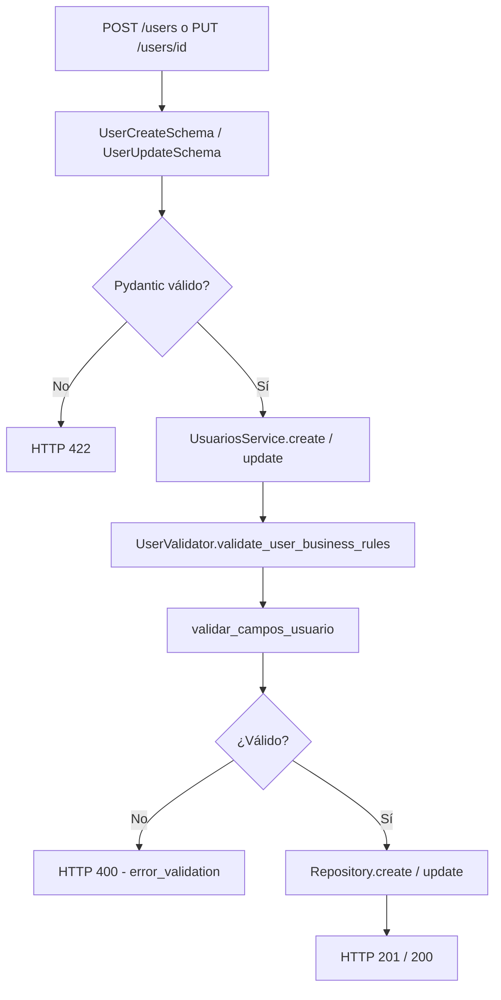

# HU — Validaciones de negocio (Usuario)

## Descripción

Como **sistema**, necesito validar los datos de entrada al crear o actualizar usuarios, para garantizar que la información cumple las reglas de negocio antes de persistirse en la base de datos.

Las validaciones se aplican en la capa de servicio y devuelven errores HTTP **400** con mensajes descriptivos en español.

---

## Criterios de aceptación

### CA1 — Tipo de documento

| # | Criterio | Estado |
|---|----------|--------|
| 1 | Solo se aceptan: `CC`, `CE`, `PAS`, `NIT`, `PEP` | ✅ |
| 2 | La comparación es case-insensitive (`cc` = `CC`) | ✅ |
| 3 | Tipos inválidos devuelven mensaje con las opciones permitidas | ✅ |

**Campo API:** `identification_type`  
**Función:** `validar_tipo_documento()` en `Utils/user_field_validators.py`

---

### CA2 — Identificación

| # | Criterio | Estado |
|---|----------|--------|
| 1 | Solo dígitos numéricos | ✅ |
| 2 | Longitud entre 6 y 15 caracteres | ✅ |
| 3 | No puede estar vacío en creación | ✅ |

**Campo API:** `identification`  
**Columna BD:** `id_number`  
**Función:** `validar_identificacion()`

---

### CA3 — Correo electrónico

| # | Criterio | Estado |
|---|----------|--------|
| 1 | Debe tener formato válido (`usuario@dominio.com`) | ✅ |
| 2 | No puede estar vacío en creación | ✅ |

**Campo API:** `email`  
**Función:** `validar_correo()`

---

### CA4 — Nombre y apellido

| # | Criterio | Estado |
|---|----------|--------|
| 1 | Solo letras y espacios (incluye tildes y ñ) | ✅ |
| 2 | Longitud entre 2 y 50 caracteres | ✅ |
| 3 | Se validan `name` y `last_name` por separado en creación | ✅ |

**Campos API:** `name`, `last_name`  
**Columna BD (apellido):** `surname`  
**Función:** `validar_nombre()`

---

### CA5 — Celular

| # | Criterio | Estado |
|---|----------|--------|
| 1 | Solo dígitos numéricos | ✅ |
| 2 | Longitud entre 7 y 10 dígitos | ✅ |
| 3 | Obligatorio al crear usuario | ✅ |

**Campo API:** `phone_number`  
**Columna BD:** `phone`  
**Función:** `validar_celular()`

---

### CA6 — Integración en el servicio

| # | Criterio | Estado |
|---|----------|--------|
| 1 | `POST /users` ejecuta todas las validaciones antes de guardar | ✅ |
| 2 | `PUT /users/{id}` valida solo los campos enviados en el body | ✅ |
| 3 | Errores de negocio devuelven HTTP 400 con `detail` descriptivo | ✅ |
| 4 | Errores de formato Pydantic siguen siendo HTTP 422 | ✅ |

---

## Reglas de validación — resumen

| Campo API | Regla | Mensaje de error (ejemplo) |
|-----------|-------|----------------------------|
| `identification_type` | CC, CE, PAS, NIT o PEP | `'XX' no es un tipo de documento válido...` |
| `identification` | 6–15 dígitos, solo números | `La identificación debe tener entre 6 y 15 dígitos.` |
| `email` | Formato email válido | `El correo no tiene un formato válido...` |
| `name` | Letras/espacios, 2–50 chars | `El nombre solo debe contener letras y espacios.` |
| `last_name` | Igual que nombre | `Apellido: El nombre solo debe contener letras y espacios.` |
| `phone_number` | 7–10 dígitos, solo números | `El celular solo debe contener números.` |

---

## Arquitectura



---

## Archivos involucrados

| Archivo | Responsabilidad |
|---------|-----------------|
| `Utils/user_field_validators.py` | Funciones de validación puras |
| `Utils/user_validator.py` | `validate_user_business_rules()` — adaptador API |
| `Services/Impl/UsuariosService.py` | Invoca validaciones en `create()` y `update()` |
| `Utils/HttpResponses/userHttpResponses.py` | `error_validation(message)` → HTTP 400 |
| `Models/users.py` | `UserCreateSchema` con `phone_number` obligatorio |
| `Utils/enums.py` | `IdentificationTypeEnum` — tipos de documento permitidos |

---

## Funciones disponibles

Definidas en `Utils/user_field_validators.py`:

| Función | Descripción |
|---------|-------------|
| `validar_tipo_documento(tipo)` | Valida contra `IdentificationTypeEnum` |
| `validar_identificacion(id)` | Dígitos, longitud 6–15 |
| `validar_correo(correo)` | Regex de email |
| `validar_nombre(nombre)` | Letras, longitud 2–50 |
| `validar_celular(celular)` | Dígitos, longitud 7–10 |
| `validar_usuario(...)` | Orquesta todas las validaciones de creación |
| `validar_campos_usuario(data, is_create)` | Adaptador para campos del API |

---

## Plan de pruebas

Ver la sección detallada [**Paso a paso por función**](#paso-a-paso-por-función) más abajo.

> Las pruebas de creación (`POST /users`) **no requieren token**. Las de actualización (`PUT /users/{id}`) **sí requieren** token con módulo `users` — ver [guía de preparación](./guia-pruebas-paso-a-paso.md).

---

## Paso a paso por función

### Body base válido (usar en todas las pruebas)

Guarda este JSON como plantilla. Solo cambia el campo que quieras probar y usa un **email único** en cada creación exitosa:

```json
{
  "name": "Mariana",
  "last_name": "Lopez",
  "email": "mariana.test01@ejemplo.com",
  "identification": "1234567890",
  "identification_type": "CC",
  "phone_number": "3001234567",
  "desired_description": "Quiero invertir"
}
```

En Swagger: **`POST /users`** → **Try it out** → pegar body → **Execute**.

---

### 1. `validar_tipo_documento()` — Tipo de documento

**Archivo:** `Utils/user_field_validators.py`

| # | Paso | Cambio en el body | HTTP | Mensaje esperado en `detail` |
|---|------|-------------------|------|------------------------------|
| 1 | Usa body base con `"identification_type": "CC"` | — | `201` | Usuario creado |
| 2 | Cambia a `"CE"` | tipo válido alternativo | `201` | Usuario creado |
| 3 | Cambia a `"cc"` (minúsculas) | case-insensitive | `201` | Usuario creado |
| 4 | Cambia a `"XX"` | tipo inválido | `400` | `'XX' no es un tipo de documento válido...` |
| 5 | Cambia a `""` | vacío | `400` | `El tipo de documento no puede estar vacío.` |

---

### 2. `validar_identificacion()` — Número de identificación

| # | Paso | Cambio en el body | HTTP | Mensaje esperado |
|---|------|-------------------|------|------------------|
| 1 | `"identification": "1234567890"` | 10 dígitos | `201` | OK |
| 2 | `"identification": "123456"` | 6 dígitos (mínimo) | `201` | OK |
| 3 | `"identification": "123456789012345"` | 15 dígitos (máximo) | `201` | OK |
| 4 | `"identification": "12345"` | 5 dígitos | `400` | `La identificación debe tener entre 6 y 15 dígitos.` |
| 5 | `"identification": "1234567890123456"` | 16 dígitos | `400` | `La identificación debe tener entre 6 y 15 dígitos.` |
| 6 | `"identification": "12345abc"` | contiene letras | `400` | `La identificación solo debe contener números.` |

---

### 3. `validar_correo()` — Correo electrónico

| # | Paso | Cambio en el body | HTTP | Mensaje esperado |
|---|------|-------------------|------|------------------|
| 1 | `"email": "usuario@dominio.com"` | formato válido | `201` | OK |
| 2 | `"email": "sin-arroba"` | sin @ | `400` | `El correo no tiene un formato válido...` |
| 3 | `"email": "usuario@"` | sin dominio | `400` | `El correo no tiene un formato válido...` |
| 4 | `"email": "usuario@dominio"` | sin extensión (.com) | `400` | `El correo no tiene un formato válido...` |

---

### 4. `validar_nombre()` — Nombre (`name`)

| # | Paso | Cambio en el body | HTTP | Mensaje esperado |
|---|------|-------------------|------|------------------|
| 1 | `"name": "Mariana"` | válido | `201` | OK |
| 2 | `"name": "José María"` | tildes y espacio | `201` | OK |
| 3 | `"name": "Ángel"` | ñ/tildes | `201` | OK |
| 4 | `"name": "Juan123"` | contiene números | `400` | `El nombre solo debe contener letras y espacios.` |
| 5 | `"name": "A"` | 1 carácter | `400` | `El nombre debe tener entre 2 y 50 caracteres.` |
| 6 | `"name": ""` | vacío | `400` | `El nombre no puede estar vacío.` |

---

### 5. `validar_nombre()` — Apellido (`last_name`)

| # | Paso | Cambio en el body | HTTP | Mensaje esperado |
|---|------|-------------------|------|------------------|
| 1 | `"last_name": "Lopez"` | válido | `201` | OK |
| 2 | `"last_name": "García"` | con tilde | `201` | OK |
| 3 | `"last_name": "Perez123"` | con números | `400` | `Apellido: El nombre solo debe contener letras y espacios.` |
| 4 | `"last_name": "L"` | muy corto | `400` | `Apellido: El nombre debe tener entre 2 y 50 caracteres.` |

---

### 6. `validar_celular()` — Teléfono (`phone_number`)

| # | Paso | Cambio en el body | HTTP | Mensaje esperado |
|---|------|-------------------|------|------------------|
| 1 | `"phone_number": "3001234567"` | 10 dígitos | `201` | OK |
| 2 | `"phone_number": "3001234"` | 7 dígitos (mínimo) | `201` | OK |
| 3 | `"phone_number": "123"` | muy corto | `400` | `El celular debe tener entre 7 y 10 dígitos.` |
| 4 | `"phone_number": "30012345678"` | 11 dígitos | `400` | `El celular debe tener entre 7 y 10 dígitos.` |
| 5 | `"phone_number": "300abc"` | con letras | `400` | `El celular solo debe contener números.` |

**Campo obligatorio en creación:**

| # | Paso | Cambio | HTTP | Mensaje |
|---|------|--------|------|---------|
| 1 | Quita `phone_number` del body | campo ausente | `422` | Error de Pydantic (campo requerido) |

---

### 7. `validar_usuario()` — Orquestador en creación

**Qué hace:** Ejecuta en orden: nombre → tipo doc → identificación → correo → celular → apellido.

| # | Paso | Acción | HTTP | Qué validar |
|---|------|--------|------|-------------|
| 1 | Envía body base completo y válido | `POST /users` | `201` | Todos los campos pasaron |
| 2 | Envía body con **un solo** error (ej. email inválido) | `POST /users` | `400` | Solo el primer error encontrado en el orden de validación |
| 3 | Repite con email válido pero nombre inválido | `POST /users` | `400` | Mensaje de nombre, no de email |

---

### 8. `validar_campos_usuario()` — Validación parcial en actualización

**Endpoint:** `PUT /users/{id}` — **requiere token** con módulo `users`.

| # | Paso | Acción | HTTP | Mensaje esperado |
|---|------|--------|------|------------------|
| 1 | Authorize en Swagger (ver [guía](./guia-pruebas-paso-a-paso.md)) | — | — | Token activo |
| 2 | `PUT /users/1` con `{"email": "correo-invalido"}` | solo email malo | `400` | Error de correo |
| 3 | `PUT /users/1` con `{"name": "Juan123"}` | solo nombre malo | `400` | Error de nombre |
| 4 | `PUT /users/1` con `{"phone_number": "123"}` | solo celular malo | `400` | Error de celular |
| 5 | `PUT /users/1` con `{"name": "Pedro"}` | campo válido | `200` | Usuario actualizado |
| 6 | `PUT /users/1` con `{"job": "Ingeniero"}` | campo sin validación de negocio | `200` | Actualiza sin error |

---

### 9. `validate_user_business_rules()` — Integración en servicio

**Archivo:** `Utils/user_validator.py` → llamado desde `UsuariosService.create()` y `.update()`

| # | Paso | Acción | HTTP | Qué confirma |
|---|------|--------|------|--------------|
| 1 | `POST /users` con datos inválidos | servicio rechaza antes de BD | `400` | La validación ocurre en capa de servicio |
| 2 | `POST /users` con datos válidos | servicio persiste | `201` | Pasa validación y guarda en BD |
| 3 | `PUT /users/{id}` con campo inválido | servicio rechaza | `400` | Misma lógica en actualización |

---

### 10. Diferencia HTTP 400 vs 422

| # | Paso | Body | HTTP | Origen |
|---|------|------|------|--------|
| 1 | Quita un campo obligatorio (`name`) | incompleto | `422` | Pydantic — schema |
| 2 | `"identification": 1234567890` (número, no string) | tipo incorrecto | `422` | Pydantic — tipo |
| 3 | `"email": "sin-arroba"` con resto válido | regla de negocio | `400` | `user_field_validators` |

---

## Diferencia entre HTTP 400 y 422

| Código | Origen | Ejemplo |
|--------|--------|---------|
| **422** | Pydantic — formato del JSON o tipos incorrectos | Enviar `identification` como número en vez de string |
| **400** | Reglas de negocio — `user_field_validators` | Email sin `@`, nombre con dígitos |

---

## Relación con otras HUs

- **HU Seguridad V2:** `POST /users` es público precisamente para permitir registro antes del login. Las validaciones de negocio actúan como primera barrera de calidad de datos.
- **Mapeo API ↔ BD:** Tras pasar las validaciones, `Utils/mappers/user_mapper.py` traduce los campos del API a las columnas reales de Supabase (ej. `identification_type` → lookup en `id_types`).
