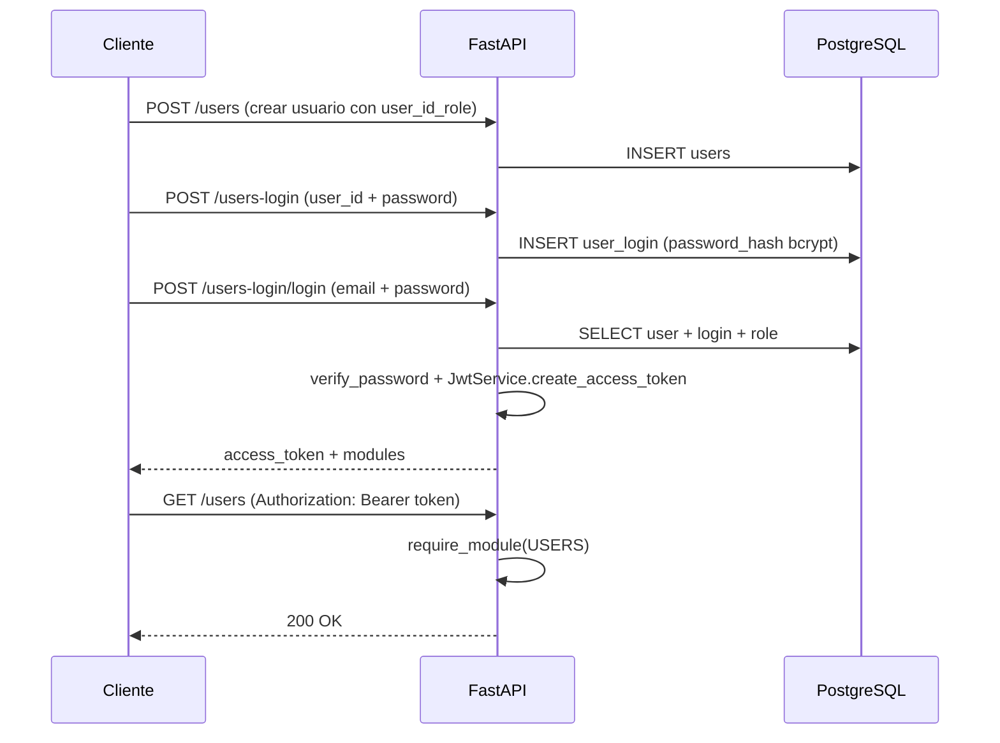

# HU — Seguridad V2 (Sesión 4)

## Descripción

Como **administrador del sistema**, necesito que la API proteja los recursos mediante autenticación y autorización basada en roles, de modo que solo usuarios autenticados con los permisos correctos puedan acceder a cada módulo.

La implementación cubre:

- Gestión de roles con módulos de acceso en base de datos.
- Almacenamiento seguro de contraseñas con Bcrypt.
- Emisión y validación de tokens JWT con expiración.
- Protección de endpoints por módulo mediante dependencias FastAPI.

---

## Criterios de aceptación

### CA1 — Roles y módulos

| # | Criterio | Estado |
|---|----------|--------|
| 1 | Los roles se almacenan en la tabla `user_roles` con un arreglo `modules` | ✅ |
| 2 | Cada módulo de la API corresponde a un valor en `AppModule` | ✅ |
| 3 | Un rol con módulo `"all"` tiene acceso a todos los módulos | ✅ |
| 4 | Si `user_roles` está vacía al iniciar, se insertan roles base (`admin`, `cliente`, `operador`) | ✅ |
| 5 | El usuario debe tener `role_id` asignado para poder iniciar sesión | ✅ |

**Módulos definidos** (`Utils/enums.py`):

| Módulo | Valor | Endpoints |
|--------|-------|-----------|
| Usuarios | `users` | `/users` (excepto `POST`) |
| Prefijos | `prefix` | `/prefix` |
| Roles | `users-role` | `/users-role` |
| Login | `users-login` | `/users-login` (excepto `POST` y `POST /login`) |

**Roles por defecto** (solo si la tabla está vacía):

| Rol | Módulos |
|-----|---------|
| `admin` | Todos (`users`, `prefix`, `users-role`, `users-login`) |
| `cliente` | `users`, `prefix` |
| `operador` | `users`, `users-login` |

---

### CA2 — Contraseñas con Bcrypt

| # | Criterio | Estado |
|---|----------|--------|
| 1 | Las contraseñas nunca se almacenan en texto plano | ✅ |
| 2 | El hash se guarda en `user_login.password_hash` | ✅ |
| 3 | Al crear o actualizar login se usa `get_password_hash()` | ✅ |
| 4 | Al autenticar se usa `verify_password()` | ✅ |

**Archivo:** `Services/Security/CryptPass.py`

**Detalle técnico:** Antes de aplicar Bcrypt, la contraseña pasa por SHA-256 para evitar la limitación de 72 bytes de Bcrypt y soportar contraseñas largas de forma íntegra.

---

### CA3 — Autenticación JWT

| # | Criterio | Estado |
|---|----------|--------|
| 1 | El login exitoso devuelve un `access_token` JWT | ✅ |
| 2 | El token incluye `user_id`, `email`, `role` y `modules` | ✅ |
| 3 | El token expira según `JWT_EXPIRE_MINUTES` (default: 60 min) | ✅ |
| 4 | La respuesta incluye `expires_in` en segundos | ✅ |
| 5 | Tokens inválidos o expirados devuelven HTTP 401 | ✅ |

**Archivo:** `Services/Security/JwtService.py`

**Payload del token:**

```json
{
  "sub": "1",
  "email": "usuario@ejemplo.com",
  "role_id": 1,
  "role": "admin",
  "modules": ["users", "prefix", "users-role", "users-login"],
  "exp": 1234567890
}
```

**Respuesta de login** (`Models/auth.py` — `LoginTokenResponseSchema`):

```json
{
  "access_token": "eyJ...",
  "token_type": "bearer",
  "expires_in": 3600,
  "user_id": 1,
  "email": "usuario@ejemplo.com",
  "role": "admin",
  "modules": ["users", "prefix", "users-role", "users-login"]
}
```

**Variables de entorno:**

| Variable | Default | Descripción |
|----------|---------|-------------|
| `JWT_SECRET_KEY` | `inverclick-dev-secret-change-in-production` | Clave de firma |
| `JWT_ALGORITHM` | `HS256` | Algoritmo |
| `JWT_EXPIRE_MINUTES` | `60` | Duración del token |

---

### CA4 — Autorización por módulo

| # | Criterio | Estado |
|---|----------|--------|
| 1 | Los endpoints protegidos exigen header `Authorization: Bearer <token>` | ✅ |
| 2 | Sin token → HTTP 401 | ✅ |
| 3 | Token válido pero sin módulo requerido → HTTP 403 | ✅ |
| 4 | Cada controller declara el módulo con `require_module(AppModule.XXX)` | ✅ |

**Archivo:** `Services/Security/auth_dependencies.py`

**Funciones:**

- `get_current_user()` — Decodifica el JWT y devuelve `AuthContext`.
- `require_module(module)` — Verifica que el usuario tenga el módulo en su rol.

---

## Endpoints públicos vs protegidos

### Públicos (sin JWT)

| Método | Ruta | Motivo |
|--------|------|--------|
| `POST` | `/users` | Registro de usuario (onboarding) |
| `POST` | `/users-login` | Creación de credenciales |
| `POST` | `/users-login/login` | Autenticación |

### Protegidos (requieren JWT + módulo)

Todos los demás endpoints de:

- `/users`
- `/prefix`
- `/users-role`
- `/users-login`

---

## Flujo de autenticación



---

## Errores de seguridad

| HTTP | Situación | Mensaje típico |
|------|-----------|----------------|
| 401 | Sin token o token inválido | `Credenciales de autenticación no provistas` / `Token inválido o expirado` |
| 401 | Email o contraseña incorrectos | `Credenciales inválidas` |
| 403 | Cuenta inactiva | `La cuenta está inactiva` |
| 403 | Usuario sin rol | `El usuario no tiene un rol asignado` |
| 403 | Rol sin módulos | `El rol no tiene módulos asignados` |
| 403 | Sin permiso al módulo | `No tiene permiso para acceder al módulo 'users'` |

---

## Archivos involucrados

| Capa | Archivos |
|------|----------|
| Modelos | `Models/auth.py`, `Models/users_login.py`, `Models/users_role.py` |
| Seguridad | `Services/Security/CryptPass.py`, `JwtService.py`, `auth_dependencies.py` |
| Servicios | `Services/Impl/UsersLoginService.py` |
| Controladores | `Controllers/UsersController.py`, `UsersLoginController.py`, `UsersRoleController.py`, `Prefixcontroller.py` |
| Repositorios | `Repositories/seed_reference_data.py`, `UsersRoleRepository.py` |
| Configuración | `Utils/enums.py` (`AppModule`), `main.py` (OpenAPI BearerAuth) |

---

## Plan de pruebas

### Prueba 1 — Login exitoso

1. `POST /users` con `user_id_role: 1`
2. `POST /users-login` con `user_id` y contraseña
3. `POST /users-login/login` con email y contraseña
4. Verificar que la respuesta contiene `access_token`, `expires_in` y `modules`

### Prueba 2 — Endpoint protegido sin token

1. `GET /users` sin header `Authorization`
2. Esperar **401**

### Prueba 3 — Token válido con permiso

1. Obtener token (prueba 1)
2. `GET /users` con `Authorization: Bearer <token>`
3. Esperar **200**

### Prueba 4 — Token válido sin permiso

1. Crear usuario con rol que no tenga módulo `users-role`
2. Obtener token
3. `GET /users-role` con el token
4. Esperar **403**

### Prueba 5 — Credenciales incorrectas

1. `POST /users-login/login` con contraseña errónea
2. Esperar **401**

### Prueba 6 — Usuario sin rol

1. Crear usuario sin `user_id_role`
2. Crear login y intentar autenticar
3. Esperar **403** (`El usuario no tiene un rol asignado`)

---

## Decisiones de diseño

1. **Login por email:** El endpoint `/users-login/login` recibe `email` (no `username`), alineado con la tabla `users.email`.
2. **Endpoints de onboarding públicos:** Crear usuario y credenciales no requiere token para permitir el flujo inicial.
3. **Módulo `"all"` como comodín:** Simplifica el rol administrador sin listar cada módulo manualmente.
4. **Seed condicional:** Los roles y tipos de documento solo se insertan si la tabla está vacía, para no sobrescribir datos existentes en Supabase.
5. **Swagger Bearer:** `main.py` registra el esquema `BearerAuth` en OpenAPI para probar desde `/docs`.

---

## Notas para producción

- Cambiar `JWT_SECRET_KEY` por un valor seguro y único.
- No commitear el archivo `.env` (usar `.env.example` como plantilla).
- Revisar que los roles existentes en Supabase tengan módulos alineados con `AppModule` si se migró desde otro esquema (ej. módulos como `propiedades` no coinciden con los de la API actual).
