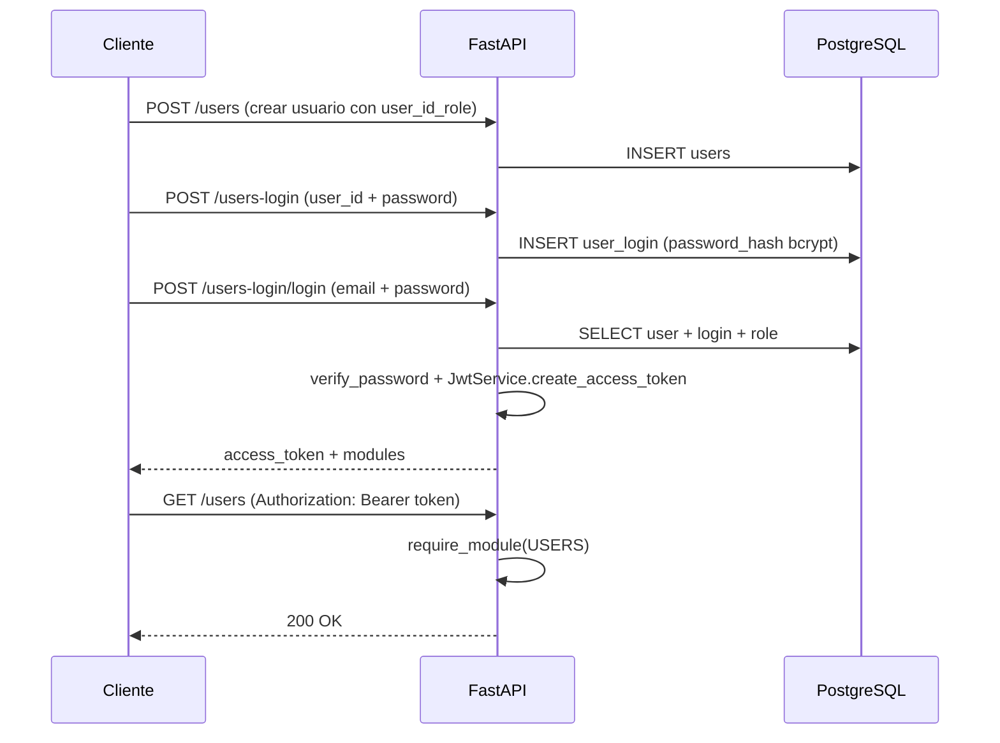

# HU — Seguridad V2 (Sesión 4)

## Descripción

Como **administrador del sistema**, necesito que la API proteja los recursos mediante autenticación y autorización basada en roles, de modo que solo usuarios autenticados con los permisos correctos puedan acceder a cada módulo.

La implementación cubre:

- Gestión de roles con módulos de acceso en base de datos.
- Almacenamiento seguro de contraseñas con Bcrypt.
- Emisión y validación de tokens JWT con expiración.
- Protección de endpoints por módulo mediante dependencias FastAPI.

---

## Criterios de aceptación

### CA1 — Roles y módulos

| # | Criterio | Estado |
|---|----------|--------|
| 1 | Los roles se almacenan en la tabla `user_roles` con un arreglo `modules` | ✅ |
| 2 | Cada módulo de la API corresponde a un valor en `AppModule` | ✅ |
| 3 | Un rol con módulo `"all"` tiene acceso a todos los módulos | ✅ |
| 4 | Si `user_roles` está vacía al iniciar, se insertan roles base (`admin`, `cliente`, `operador`) | ✅ |
| 5 | El usuario debe tener `role_id` asignado para poder iniciar sesión | ✅ |

**Módulos definidos** (`Utils/enums.py`):

| Módulo | Valor | Endpoints |
|--------|-------|-----------|
| Usuarios | `users` | `/users` (excepto `POST`) |
| Prefijos | `prefix` | `/prefix` |
| Roles | `users-role` | `/users-role` |
| Login | `users-login` | `/users-login` (excepto `POST` y `POST /login`) |

**Roles por defecto** (solo si la tabla está vacía):

| Rol | Módulos |
|-----|---------|
| `admin` | Todos (`users`, `prefix`, `users-role`, `users-login`) |
| `cliente` | `users`, `prefix` |
| `operador` | `users`, `users-login` |

---

### CA2 — Contraseñas con Bcrypt

| # | Criterio | Estado |
|---|----------|--------|
| 1 | Las contraseñas nunca se almacenan en texto plano | ✅ |
| 2 | El hash se guarda en `user_login.password_hash` | ✅ |
| 3 | Al crear o actualizar login se usa `get_password_hash()` | ✅ |
| 4 | Al autenticar se usa `verify_password()` | ✅ |

**Archivo:** `Services/Security/CryptPass.py`

**Detalle técnico:** Antes de aplicar Bcrypt, la contraseña pasa por SHA-256 para evitar la limitación de 72 bytes de Bcrypt y soportar contraseñas largas de forma íntegra.

---

### CA3 — Autenticación JWT

| # | Criterio | Estado |
|---|----------|--------|
| 1 | El login exitoso devuelve un `access_token` JWT | ✅ |
| 2 | El token incluye `user_id`, `email`, `role` y `modules` | ✅ |
| 3 | El token expira según `JWT_EXPIRE_MINUTES` (default: 60 min) | ✅ |
| 4 | La respuesta incluye `expires_in` en segundos | ✅ |
| 5 | Tokens inválidos o expirados devuelven HTTP 401 | ✅ |

**Archivo:** `Services/Security/JwtService.py`

**Payload del token:**

```json
{
  "sub": "1",
  "email": "usuario@ejemplo.com",
  "role_id": 1,
  "role": "admin",
  "modules": ["users", "prefix", "users-role", "users-login"],
  "exp": 1234567890
}
```

**Respuesta de login** (`Models/auth.py` — `LoginTokenResponseSchema`):

```json
{
  "access_token": "eyJ...",
  "token_type": "bearer",
  "expires_in": 3600,
  "user_id": 1,
  "email": "usuario@ejemplo.com",
  "role": "admin",
  "modules": ["users", "prefix", "users-role", "users-login"]
}
```

**Variables de entorno:**

| Variable | Default | Descripción |
|----------|---------|-------------|
| `JWT_SECRET_KEY` | `inverclick-dev-secret-change-in-production` | Clave de firma |
| `JWT_ALGORITHM` | `HS256` | Algoritmo |
| `JWT_EXPIRE_MINUTES` | `60` | Duración del token |

---

### CA4 — Autorización por módulo

| # | Criterio | Estado |
|---|----------|--------|
| 1 | Los endpoints protegidos exigen header `Authorization: Bearer <token>` | ✅ |
| 2 | Sin token → HTTP 401 | ✅ |
| 3 | Token válido pero sin módulo requerido → HTTP 403 | ✅ |
| 4 | Cada controller declara el módulo con `require_module(AppModule.XXX)` | ✅ |

**Archivo:** `Services/Security/auth_dependencies.py`

**Funciones:**

- `get_current_user()` — Decodifica el JWT y devuelve `AuthContext`.
- `require_module(module)` — Verifica que el usuario tenga el módulo en su rol.

---

## Endpoints públicos vs protegidos

### Públicos (sin JWT)

| Método | Ruta | Motivo |
|--------|------|--------|
| `POST` | `/users` | Registro de usuario (onboarding) |
| `POST` | `/users-login` | Creación de credenciales |
| `POST` | `/users-login/login` | Autenticación |

### Protegidos (requieren JWT + módulo)

Todos los demás endpoints de:

- `/users`
- `/prefix`
- `/users-role`
- `/users-login`

---

## Flujo de autenticación



---

## Errores de seguridad

| HTTP | Situación | Mensaje típico |
|------|-----------|----------------|
| 401 | Sin token o token inválido | `Credenciales de autenticación no provistas` / `Token inválido o expirado` |
| 401 | Email o contraseña incorrectos | `Credenciales inválidas` |
| 403 | Cuenta inactiva | `La cuenta está inactiva` |
| 403 | Usuario sin rol | `El usuario no tiene un rol asignado` |
| 403 | Rol sin módulos | `El rol no tiene módulos asignados` |
| 403 | Sin permiso al módulo | `No tiene permiso para acceder al módulo 'users'` |

---

## Archivos involucrados

| Capa | Archivos |
|------|----------|
| Modelos | `Models/auth.py`, `Models/users_login.py`, `Models/users_role.py` |
| Seguridad | `Services/Security/CryptPass.py`, `JwtService.py`, `auth_dependencies.py` |
| Servicios | `Services/Impl/UsersLoginService.py` |
| Controladores | `Controllers/UsersController.py`, `UsersLoginController.py`, `UsersRoleController.py`, `Prefixcontroller.py` |
| Repositorios | `Repositories/seed_reference_data.py`, `UsersRoleRepository.py` |
| Configuración | `Utils/enums.py` (`AppModule`: users, prefix, users-role, users-login, propiedades, construction-companies, sales), `main.py` (OpenAPI **BearerAuth** único) |

---

## Plan de pruebas

Ver la sección detallada [**Paso a paso por función**](#paso-a-paso-por-función) más abajo, o la [guía de preparación](./guia-pruebas-paso-a-paso.md) para configurar Swagger y el token JWT.

---

## Paso a paso por función

> **Pre-requisito:** Completa los pasos 0.1 a 0.7 de [guia-pruebas-paso-a-paso.md](./guia-pruebas-paso-a-paso.md) antes de las pruebas que requieren token.

---

### 1. `ensure_default_roles()` — Seed de roles (CA1)

**Qué hace:** Si la tabla `user_roles` está vacía al iniciar la API, inserta `admin`, `cliente` y `operador`.

| Paso | Acción | Resultado esperado |
|------|--------|-------------------|
| 1 | Reinicia la API (`uvicorn main:app --reload`) | La API arranca sin errores |
| 2 | En Swagger, abre **`GET /users-role`** (con token admin) | `200 OK` — lista de roles |
| 3 | Verifica que existen roles con `modules` definidos | `admin` debe tener `"all"` o todos los módulos |

**Probar rol con módulo `"all"`:**

| Paso | Acción | Resultado esperado |
|------|--------|-------------------|
| 1 | `GET /users-role/1` con token admin | `200` — `modules` contiene `"all"` o los 4 módulos |
| 2 | Con el mismo token, prueba `GET /users`, `GET /prefix`, `GET /users-login` | Todos responden `200` |

---

### 2. `get_password_hash()` — Hash Bcrypt al crear login (CA2)

**Qué hace:** Almacena la contraseña hasheada en `user_login.password_hash`, nunca en texto plano.

| Paso | Acción | Resultado esperado |
|------|--------|-------------------|
| 1 | Crea un usuario nuevo con `POST /users` (sin token) | `201` — anota `id` |
| 2 | `POST /users-login` con `user_password: "MiClave123"` | `201` — login creado |
| 3 | (Opcional) Consulta en Supabase: `SELECT password_hash FROM user_login WHERE user_id = X` | El hash empieza con `$2b$` (formato bcrypt), **no** es `MiClave123` |

---

### 3. `verify_password()` — Verificación al login (CA2)

**Qué hace:** Compara la contraseña ingresada contra el hash almacenado.

**Prueba A — Contraseña correcta:**

| Paso | Endpoint | Body | Esperado |
|------|----------|------|----------|
| 1 | `POST /users-login/login` | `{"email": "admin.prueba@inverclick.com", "user_password": "ClaveSegura123"}` | `200` — devuelve `access_token` |

**Prueba B — Contraseña incorrecta:**

| Paso | Endpoint | Body | Esperado |
|------|----------|------|----------|
| 1 | `POST /users-login/login` | `{"email": "admin.prueba@inverclick.com", "user_password": "ClaveIncorrecta"}` | `401` — `"Usuario o contraseña incorrectos"` |

---

### 4. `JwtService.create_access_token()` — Emisión de JWT (CA3)

**Qué hace:** Genera un token JWT con datos del usuario y expiración.

| Paso | Acción | Resultado esperado |
|------|--------|-------------------|
| 1 | `POST /users-login/login` con credenciales válidas | `200` |
| 2 | Verifica campo `access_token` | String largo que empieza con `eyJ` |
| 3 | Verifica `token_type` | `"bearer"` |
| 4 | Verifica `expires_in` | `3600` (si `JWT_EXPIRE_MINUTES=60`) |
| 5 | Verifica `user_id`, `email`, `role` | Coinciden con el usuario |
| 6 | Verifica `modules` | Array con módulos del rol (ej. `["users","prefix","users-role","users-login"]`) |

---

### 5. `JwtService.decode_token()` — Token inválido o expirado (CA3)

| Paso | Acción | Resultado esperado |
|------|--------|-------------------|
| 1 | En Swagger **Authorize** (BearerAuth), pega un token falso: `token-invalido` | — |
| 2 | `GET /users` | `401` — `"Token inválido o expirado"` |
| 3 | Clic en **Authorize** → **Logout** (dejar vacío) | — |
| 4 | `GET /users` sin token | `401` — `"Credenciales de autenticación no provistas"` |

---

### 6. `get_current_user()` — Extracción del usuario del token (CA4)

| Paso | Acción | Resultado esperado |
|------|--------|-------------------|
| 1 | Obtén token válido (`POST /users-login/login`) | `200` |
| 2 | Authorize en Swagger (BearerAuth) con solo el `<token>` | — |
| 3 | `GET /users` | `200` — lista de usuarios (el token fue aceptado y decodificado) |

---

### 7. `require_module()` — Autorización por módulo (CA4)

**Prueba A — Acceso permitido (admin con módulo `users`):**

| Paso | Endpoint | Token | Esperado |
|------|----------|-------|----------|
| 1 | `GET /users` | Admin | `200` |
| 2 | `GET /users-role` | Admin | `200` |
| 3 | `GET /users-login` | Admin | `200` |
| 4 | `GET /prefix/` | Admin | `200` |

**Prueba B — Acceso denegado (rol sin el módulo):**

| Paso | Acción | Esperado |
|------|--------|----------|
| 1 | Crea usuario con `user_id_role` de un rol **sin** módulo `users-role` (ej. rol `cliente`) | `201` |
| 2 | Crea login y obtén su token | `200` |
| 3 | Authorize con ese token | — |
| 4 | `GET /users-role` | `403` — `"No tiene permiso para acceder al módulo 'users-role'"` |

---

### 8. Login — Usuario sin rol asignado

| Paso | Acción | Esperado |
|------|--------|----------|
| 1 | `POST /users` **sin** `user_id_role` (email único) | `201` |
| 2 | `POST /users-login` con ese `user_id` | `201` |
| 3 | `POST /users-login/login` | `403` — `"El usuario no tiene un rol asignado"` |

---

### 9. Login — Cuenta inactiva

| Paso | Acción | Esperado |
|------|--------|----------|
| 1 | Con token admin, `PUT /users-login/{login_id}` con `{"active": false}` | `200` |
| 2 | `POST /users-login/login` con ese usuario | `403` — `"La cuenta de usuario se encuentra inactiva"` |
| 3 | Vuelve a activar: `PUT` con `{"active": true}` | `200` |

---

### 10. Endpoints protegidos — Módulo `users`

| Función / Endpoint | Método | Token requerido | Módulo | Pasos |
|--------------------|--------|-----------------|--------|-------|
| `get_all_users` | `GET /users` | Sí | `users` | Authorize → Execute → `200` lista |
| `get_user_by_id` | `GET /users/{id}` | Sí | `users` | Usa un id existente → `200` |
| `get_user_by_email` | `GET /users/email/{email}` | Sí | `users` | Usa email existente → `200` |
| `create_user` | `POST /users` | **No** | — | Body válido → `201` |
| `update_user` | `PUT /users/{id}` | Sí | `users` | Body parcial → `200` |
| `delete_user` | `DELETE /users/{id}` | Sí | `users` | Id existente → `200` con `"success": true` |

---

### 11. Endpoints protegidos — Módulo `users-login`

| Función / Endpoint | Método | Token | Pasos |
|--------------------|--------|-------|-------|
| `login` | `POST /users-login/login` | No | Email + password → `200` + token |
| `create_login` | `POST /users-login` | No | user_id + password → `201` |
| `get_all_logins` | `GET /users-login` | Sí | Authorize → `200` |
| `get_login_by_id` | `GET /users-login/{id}` | Sí | Id existente → `200` |
| `get_login_by_user_id` | `GET /users-login/user/{user_id}` | Sí | user_id → `200` |
| `get_login_by_email` | `GET /users-login/email/{email}` | Sí | email → `200` |
| `update_login` | `PUT /users-login/{id}` | Sí | `{"user_password": "NuevaClave456"}` → `200` |
| `delete_login` | `DELETE /users-login/{id}` | Sí | Id → `200` |

**Probar cambio de contraseña (Bcrypt en update):**

| Paso | Acción | Esperado |
|------|--------|----------|
| 1 | `PUT /users-login/{id}` con nueva contraseña | `200` |
| 2 | `POST /users-login/login` con contraseña **antigua** | `401` |
| 3 | `POST /users-login/login` con contraseña **nueva** | `200` + token |

---

### 12. Endpoints protegidos — Módulo `users-role`

| Función / Endpoint | Método | Body ejemplo | Esperado |
|--------------------|--------|--------------|----------|
| `get_all_roles` | `GET /users-role` | — | `200` lista |
| `get_role_by_id` | `GET /users-role/{id}` | — | `200` |
| `get_role_by_name` | `GET /users-role/name/admin` | — | `200` |
| `create_role` | `POST /users-role` | `{"role": "tester", "modules": ["users"]}` | `201` |
| `update_role` | `PUT /users-role/{id}` | `{"modules": ["users", "prefix"]}` | `200` |
| `delete_role` | `DELETE /users-role/{id}` | — | `200` |

---

### 13. Endpoints protegidos — Módulo `prefix`

| Función / Endpoint | Método | Pasos | Esperado |
|--------------------|--------|-------|----------|
| `get_all_prefixes` | `GET /prefix/` | Authorize → Execute | `200` lista |
| `get_prefix_by_id` | `GET /prefix/{id}` | Usa id existente en BD | `200` o `404` si no existe |

---

## Decisiones de diseño

1. **Login por email:** El endpoint `/users-login/login` recibe `email` (no `username`), alineado con la tabla `users.email`.
2. **Endpoints de onboarding públicos:** Crear usuario y credenciales no requiere token para permitir el flujo inicial.
3. **Módulo `"all"` como comodín:** Simplifica el rol administrador sin listar cada módulo manualmente.
4. **Seed condicional:** Los roles y tipos de documento solo se insertan si la tabla está vacía, para no sobrescribir datos existentes en Supabase.
5. **Swagger Bearer:** `HTTPBearer(scheme_name="BearerAuth")` + `main.custom_openapi` exponen un solo esquema Authorize. Pega solo el JWT (sin prefijo `Bearer`).
6. **Módulos de negocio:** `/construction-companies` exige `construction-companies`; `/real-estate` y fases exigen `propiedades`; `/sales` exige `sales`; `/leads` exige `leads`. El rol `constructora` se sincroniza en el seed (sin `leads`).

---

## Notas para producción

- Cambiar `JWT_SECRET_KEY` por un valor seguro y único.
- No commitear el archivo `.env` (usar `.env.example` como plantilla).
- Revisar que los roles existentes en Supabase tengan módulos alineados con `AppModule` si se migró desde otro esquema (ej. módulos como `propiedades` no coinciden con los de la API actual).
