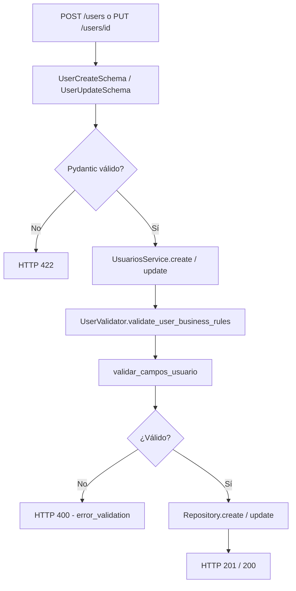

# HU — Validaciones de negocio (Usuario)

## Descripción

Como **sistema**, necesito validar los datos de entrada al crear o actualizar usuarios, para garantizar que la información cumple las reglas de negocio antes de persistirse en la base de datos.

Las validaciones se aplican en la capa de servicio y devuelven errores HTTP **400** con mensajes descriptivos en español.

---

## Criterios de aceptación

### CA1 — Tipo de documento

| # | Criterio | Estado |
|---|----------|--------|
| 1 | Solo se aceptan: `CC`, `CE`, `PAS`, `NIT`, `PEP` | ✅ |
| 2 | La comparación es case-insensitive (`cc` = `CC`) | ✅ |
| 3 | Tipos inválidos devuelven mensaje con las opciones permitidas | ✅ |

**Campo API:** `identification_type`  
**Función:** `validar_tipo_documento()` en `Utils/user_field_validators.py`

---

### CA2 — Identificación

| # | Criterio | Estado |
|---|----------|--------|
| 1 | Solo dígitos numéricos | ✅ |
| 2 | Longitud entre 6 y 15 caracteres | ✅ |
| 3 | No puede estar vacío en creación | ✅ |

**Campo API:** `identification`  
**Columna BD:** `id_number`  
**Función:** `validar_identificacion()`

---

### CA3 — Correo electrónico

| # | Criterio | Estado |
|---|----------|--------|
| 1 | Debe tener formato válido (`usuario@dominio.com`) | ✅ |
| 2 | No puede estar vacío en creación | ✅ |

**Campo API:** `email`  
**Función:** `validar_correo()`

---

### CA4 — Nombre y apellido

| # | Criterio | Estado |
|---|----------|--------|
| 1 | Solo letras y espacios (incluye tildes y ñ) | ✅ |
| 2 | Longitud entre 2 y 50 caracteres | ✅ |
| 3 | Se validan `name` y `last_name` por separado en creación | ✅ |

**Campos API:** `name`, `last_name`  
**Columna BD (apellido):** `surname`  
**Función:** `validar_nombre()`

---

### CA5 — Celular

| # | Criterio | Estado |
|---|----------|--------|
| 1 | Solo dígitos numéricos | ✅ |
| 2 | Longitud entre 7 y 10 dígitos | ✅ |
| 3 | Obligatorio al crear usuario | ✅ |

**Campo API:** `phone_number`  
**Columna BD:** `phone`  
**Función:** `validar_celular()`

---

### CA6 — Integración en el servicio

| # | Criterio | Estado |
|---|----------|--------|
| 1 | `POST /users` ejecuta todas las validaciones antes de guardar | ✅ |
| 2 | `PUT /users/{id}` valida solo los campos enviados en el body | ✅ |
| 3 | Errores de negocio devuelven HTTP 400 con `detail` descriptivo | ✅ |
| 4 | Errores de formato Pydantic siguen siendo HTTP 422 | ✅ |

---

## Reglas de validación — resumen

| Campo API | Regla | Mensaje de error (ejemplo) |
|-----------|-------|----------------------------|
| `identification_type` | CC, CE, PAS, NIT o PEP | `'XX' no es un tipo de documento válido...` |
| `identification` | 6–15 dígitos, solo números | `La identificación debe tener entre 6 y 15 dígitos.` |
| `email` | Formato email válido | `El correo no tiene un formato válido...` |
| `name` | Letras/espacios, 2–50 chars | `El nombre solo debe contener letras y espacios.` |
| `last_name` | Igual que nombre | `Apellido: El nombre solo debe contener letras y espacios.` |
| `phone_number` | 7–10 dígitos, solo números | `El celular solo debe contener números.` |

---

## Arquitectura



---

## Archivos involucrados

| Archivo | Responsabilidad |
|---------|-----------------|
| `Utils/user_field_validators.py` | Funciones de validación puras |
| `Utils/user_validator.py` | `validate_user_business_rules()` — adaptador API |
| `Services/Impl/UsuariosService.py` | Invoca validaciones en `create()` y `update()` |
| `Utils/HttpResponses/userHttpResponses.py` | `error_validation(message)` → HTTP 400 |
| `Models/users.py` | `UserCreateSchema` con `phone_number` obligatorio |
| `Utils/enums.py` | `IdentificationTypeEnum` — tipos de documento permitidos |

---

## Funciones disponibles

Definidas en `Utils/user_field_validators.py`:

| Función | Descripción |
|---------|-------------|
| `validar_tipo_documento(tipo)` | Valida contra `IdentificationTypeEnum` |
| `validar_identificacion(id)` | Dígitos, longitud 6–15 |
| `validar_correo(correo)` | Regex de email |
| `validar_nombre(nombre)` | Letras, longitud 2–50 |
| `validar_celular(celular)` | Dígitos, longitud 7–10 |
| `validar_usuario(...)` | Orquesta todas las validaciones de creación |
| `validar_campos_usuario(data, is_create)` | Adaptador para campos del API |

---

## Plan de pruebas

Todas las pruebas se ejecutan en `POST /users` (endpoint público, sin token).

### Caso válido — esperar 201

```json
{
  "name": "Mariana",
  "last_name": "Lopez",
  "email": "mariana@ejemplo.com",
  "identification": "1234567890",
  "identification_type": "CC",
  "phone_number": "3001234567",
  "desired_description": "Quiero invertir"
}
```

### Casos inválidos — esperar 400

| Caso | Campo modificado | Resultado esperado |
|------|------------------|-------------------|
| Email mal formado | `"email": "sin-arroba"` | 400 — formato de correo |
| Nombre con números | `"name": "Juan123"` | 400 — solo letras |
| Tipo doc inválido | `"identification_type": "XX"` | 400 — tipo no válido |
| ID corta | `"identification": "123"` | 400 — longitud |
| ID con letras | `"identification": "12345abc"` | 400 — solo números |
| Celular corto | `"phone_number": "123"` | 400 — longitud celular |
| Celular con letras | `"phone_number": "300abc"` | 400 — solo números |

### Prueba de actualización — esperar 400

1. Obtener JWT con rol que tenga módulo `users`
2. `PUT /users/{id}` con body: `{ "email": "correo-invalido" }`
3. Esperar **400**

---

## Diferencia entre HTTP 400 y 422

| Código | Origen | Ejemplo |
|--------|--------|---------|
| **422** | Pydantic — formato del JSON o tipos incorrectos | Enviar `identification` como número en vez de string |
| **400** | Reglas de negocio — `user_field_validators` | Email sin `@`, nombre con dígitos |

---

## Relación con otras HUs

- **HU Seguridad V2:** `POST /users` es público precisamente para permitir registro antes del login. Las validaciones de negocio actúan como primera barrera de calidad de datos.
- **Mapeo API ↔ BD:** Tras pasar las validaciones, `Utils/mappers/user_mapper.py` traduce los campos del API a las columnas reales de Supabase (ej. `identification_type` → lookup en `id_types`).
