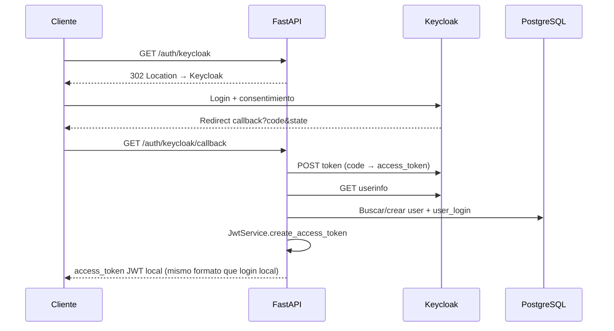

# HU04 — Seguridad Avanzada y Autenticación Híbrida (Keycloak / SSO)

## Descripción

Como **usuario y administrador** de Inverclick, quiero iniciar sesión con un proveedor externo (Keycloak/SSO) además del login local, para acceder sin otra contraseña, manteniendo roles, permisos RBAC y trazabilidad.

La integración **coexiste** con el login tradicional (`POST /users-login/login`). Ambos caminos emiten el **mismo JWT local** firmado por FastAPI, por lo que los controladores protegidos no cambian.

---

## Criterios de aceptación

### CA1 — Autenticación híbrida (coexistencia)

| # | Criterio | Estado |
|---|----------|--------|
| 1 | `POST /users-login/login` sigue validando credenciales locales contra Supabase | ✅ |
| 2 | `GET /auth/keycloak` redirige al servidor Keycloak | ✅ |
| 3 | `GET /auth/keycloak/callback` recibe el code OAuth y completa el flujo | ✅ |
| 4 | Local y Keycloak emiten el mismo formato de JWT (`LoginTokenResponseSchema`) | ✅ |

### CA2 — Auto-registro y rol por defecto

| # | Criterio | Estado |
|---|----------|--------|
| 1 | Primer ingreso SSO con correo inexistente crea perfil local automáticamente | ✅ |
| 2 | Se asigna el rol base `Usuario` (módulos `users`, `prefix`) | ✅ |
| 3 | Si el correo ya existe, se vincula `external_id` sin duplicar el usuario | ✅ |

### CA3 — Flexibilidad en base de datos

| # | Criterio | Estado |
|---|----------|--------|
| 1 | `user_login.password_hash` es nullable | ✅ |
| 2 | Columna `auth_provider` (`local` \| `keycloak` \| `hybrid`) | ✅ |
| 3 | Columna `external_id` (subject Keycloak), única cuando no es null | ✅ |
| 4 | Cuentas antiguas quedan con `auth_provider = local` | ✅ |

**Migración:** `supabase/migrations/20260927120000_hu04_auth_hibrida_keycloak.sql`

### CA4 — Arquitectura / Clean Code

| # | Criterio | Estado |
|---|----------|--------|
| 1 | Comunicación con Keycloak aislada en `Services/Security/KeycloakService.py` | ✅ |
| 2 | Orquestación en `Services/Impl/AuthHybridService.py` | ✅ |
| 3 | Controladores de módulos protegidos sin cambios de autorización | ✅ |

---

## Endpoints nuevos (públicos)

| Método | Ruta | Descripción |
|--------|------|-------------|
| `GET` | `/auth/keycloak` | Redirect 302 a Keycloak (Authorization Code) |
| `GET` | `/auth/keycloak/callback` | Intercambia `code`, aprovisiona usuario y devuelve JWT local |

El login local **no se modifica** en contrato:

| Método | Ruta | Descripción |
|--------|------|-------------|
| `POST` | `/users-login/login` | Login email + contraseña → JWT local |

---

## Variables de entorno

| Variable | Obligatoria | Descripción |
|----------|-------------|-------------|
| `KEYCLOAK_SERVER_URL` | Sí (para SSO) | URL base del servidor (sin `/` final) |
| `KEYCLOAK_REALM` | Sí | Realm de Keycloak |
| `KEYCLOAK_CLIENT_ID` | Sí | Client ID (confidential) |
| `KEYCLOAK_CLIENT_SECRET` | Sí | Client secret |
| `KEYCLOAK_REDIRECT_URI` | Sí | Debe coincidir con el Valid Redirect URI del client |
| `KEYCLOAK_STATE_SECRET` | No | Firma del `state` OAuth (default: `JWT_SECRET_KEY`) |

Ejemplo de redirect URI local:

```text
http://127.0.0.1:8000/auth/keycloak/callback
```

---

## Archivos principales

| Archivo | Responsabilidad |
|---------|-----------------|
| `Services/Security/KeycloakService.py` | Auth URL, exchange code, userinfo |
| `Services/Impl/AuthHybridService.py` | Aprovisionamiento + JWT unificado |
| `Controllers/AuthController.py` | Endpoints GET SSO |
| `Models/users_login.py` | `password_hash` nullable, `auth_provider`, `external_id` |
| `Repositories/seed_reference_data.py` | Rol `Usuario` + `ensure_sso_default_role` |
| `Utils/enums.py` | `AuthProvider` |

---

## Flujo SSO



---

## Paso a paso para probar

### 0. Aplicar migración

```bash
# Con Supabase CLI (proyecto vinculado)
npx supabase db push

# O ejecutar el SQL de la migración en el SQL Editor de Supabase
```

### 1. Configurar Keycloak

1. Crear realm (ej. `inverclick`) y client confidential `inverclick-api`.
2. Valid Redirect URIs: `http://127.0.0.1:8000/auth/keycloak/callback`
3. Completar variables en `.env`.

### 2. Probar login local (regresión CA1)

`POST /users-login/login` con email/password existentes → JWT válido.

### 3. Probar SSO

1. Abrir en el navegador: `http://127.0.0.1:8000/auth/keycloak`
2. Autenticarse en Keycloak.
3. Tras el redirect, la API responde con el mismo JSON de token que el login local.
4. Usar ese `access_token` en **Authorize** de Swagger (esquema **BearerAuth**: pegar solo el token, sin la palabra `Bearer`) para endpoints protegidos.

### 4. Verificar auto-registro (CA2)

Con un usuario Keycloak cuyo correo **no** exista en `users`:

- Se crea fila en `users` con `role_id` del rol `Usuario`.
- Se crea `user_login` con `password_hash` NULL, `auth_provider = keycloak`, `external_id = sub`.

---

## Errores SSO

| HTTP | Situación |
|------|-----------|
| 400 | Sin `code` o `state` inválido/expirado |
| 502 | Fallo de comunicación / rechazo de Keycloak |
| 503 | Variables Keycloak no configuradas |
| 403 | Cuenta inactiva o sin rol/módulos |
